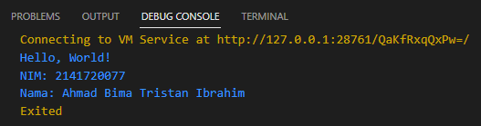

# Week 1 

```sh
Ahmad Bima Tristan Ibrahim
```

```sh
2141720077
```

# Source Code

```dart
void main() {
  print('Hello, World!');
  print('NIM: 2141720077');
  print('Nama: Ahmad Bima Tristan Ibrahim');
}
```

# Output

