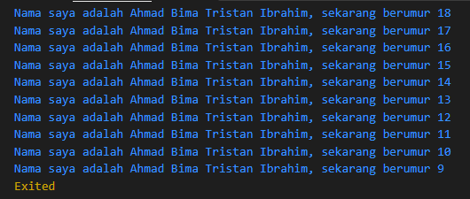

# Week 12

```sh
Ahmad Bima Tristan Ibrahim
```

```sh
2141720077
```
‎ 

# Soal 1

### Modifikasilah kode pada baris 3 di VS Code atau Editor Code favorit Anda berikut ini agar mendapatkan keluaran (output) sesuai yang diminta!
‎ 
## Code
```dart
void main() {
  for (int i = 0; i < 10; i++) {
    print('hello ${i + 2}');
```
‎ 
## Output yang diminta: 


‎ 

## Code yang sudah di ubah
```dart
void main() {
  for (int i = 0; i < 10; i++) {
    print('Nama saya adalah Ahmad Bima Tristan Ibrahim, sekarang berumur ${18 - i}');
  }
}
```
‎ 
## Hasil Output


‎ 


# Soal 2
### Mengapa sangat penting untuk memahami bahasa pemrograman Dart sebelum kita menggunakan framework Flutter ? Jelaskan!
‎ 
### Jawab: Karena dart adalah basic atau bahasa dasar yang digunakan dalam framework flutter, jika kita sudah mempelajari atau memahami dart, maka akan mempermudah kita untuk memahami konsep-konsep yang ada di dalam flutter
‎ 

# Soal 3
### Rangkumlah materi dari codelab ini menjadi poin-poin penting yang dapat Anda gunakan untuk membantu proses pengembangan aplikasi mobile menggunakan framework Flutter.
‎ 
### Jawab: 
### Pada pertemuan kali ini kita mempelajari beberapa materi tentang dart, yaitu
* Pengenalan dart, dart bertujuan  untuk menggabungkan kelebihan-kelebihan dari sebagian besar bahasa tingkat tinggi, dart juga memiliki fitur-fitur seperti Productive tooling, Garbage collection, Type annotations, Statically typed, dan Portability
* Evolusi dari dart, dart yang awal nya berfokus pada pengembangan web, dengan tujuan utama menggantikan JavaScript, sekarang telah fokus pada mobile development, termasuk framework Flutter. Sekarang dart adalah bahasa modern yang luar biasa, mendukung lintas platform, dan memiliki tujuan umum dengan terus meningkatkan fitur-fiturnya, membuatnya lebih kekinian dan fleksibel. Itulah sebabnya tim Flutter framework memilih bahasa Dart untuk digunakan
* Bagaimana cara dart bekerja, dart dapat bekerja fleksibel dengan dua cara yaitu dari dart virtual machine (VM) dan javascript compilation
* Pengenalan struktur yang ada pada dart, bahasa pemrograman dart tidak jauh berbeda dengan javascript, dart juga dirancang untuk  object-oriented, dan dart juga memiliki operator yang mirip dengan javascript seperti 
    + Dart operators
    + Arithmetic operators
    + Increment and decrement operators
    + Equality and relational operators
    + Logical operators
* Hands-on with dart atau mencoba mengetik dan menjalankan code program dart