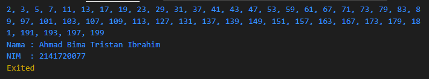

## Laporan Praktikum

## Week 3

```sh
Ahmad Bima Tristan Ibrahim
```

```sh
2141720077
```

## Praktikum 1: Menerapkan Control Flows ("if/else")

### Langkah 1:

Ketik atau salin kode program berikut ke dalam fungsi ```main()```.

```dart
String test = "test2";
if (test == "test1") {
   print("Test1");
} else If (test == "test2") {
   print("Test2");
} Else {
   print("Something else");
}

if (test == "test2") print("Test2 again");
```

### Langkah 2:

Silakan coba eksekusi (Run) kode pada langkah 1 tersebut. Apa yang terjadi? Jelaskan!

Jawab:

Terdapat error dikarenakan ada beberapa kesalahan dalam kode program yang diberikan:


- Kesalahan penulisan `if` dan `else if`:

Kata kunci `if` harus ditulis dengan huruf kecil, bukan huruf besar. 

Sama halnya dengan `else if` dan `else`.

- Kesalahan penulisan `else`:

Kata kunci `else` juga harus ditulis dengan huruf kecil, bukan huruf besar.

- Perbandingan string:

Untuk membandingkan string, kita sebaiknya menggunakan operator `==` (sama dengan) daripada `=`. Penggunaan `=` hanya akan menghasilkan kesalahan sintaksis.

Dengan memperbaiki kesalahan-kesalahan tersebut, kode dapat diperbaiki seperti ini:

```dart
void main() {
  String test = "test2";

  if (test == "test1") {
    print("Test1");
  } else if (test == "test2") {
    print("Test2");
  } else {
    print("Something else");
  }

  if (test == "test2") print("Test2 again");
}
```

Result:


### Langkah 3:

Tambahkan kode program berikut, lalu coba eksekusi (Run) kode Anda.

```dart
String test = "true";
if (test) {
   print("Kebenaran");
}
```

Apa yang terjadi? Jika terjadi error, silakan perbaiki namun tetap menggunakan *if/else*.

Jawab: 

Terjadi error dikarenakan terdapat kesalahan setelah ditambahkan kode program di langkah 3.


Kesalahan kode program nya sebagai berikut:

- Penggunaan `String` untuk variabel test:
  
Pada kode program mendeklarasikan variabel `test` sebagai `String`, tetapi kemudian mencoba memeriksa kebenaran nilai `test` dengan kondisi `if (test)`. 

Ini adalah kesalahan karena kondisi `if` memerlukan ekspresi boolean (true atau false), sedangkan `test` adalah sebuah string. 

Kita perlu mengubah tipe data `test` menjadi boolean untuk kondisi ini.

- Pendeklarasian ulang variabel `test`:
  
Pada kode program mendeklarasikan ulang variabel `test` dengan tipe data `String` setelah penggunaan awalnya. 

Ini juga adalah kesalahan. Kita hanya perlu mendeklarasikan variabel `test` sekali.

- Pengecekan string:

Saat membandingkan string, kita harus menggunakan operator `==` daripada `=`. Penggunaan `=` adalah operator penugasan, sementara `==` digunakan untuk memeriksa kesamaan antara dua nilai.

Dengan memperbaiki kesalahan-kesalahan tersebut, kode dapat diperbaiki seperti ini:

```dart
void main() {
  String test = "test2";

  if (test == "test1") {
    print("Test1");
  } else if (test == "test2") {
    print("Test2");
  } else {
    print("Something else");
  }

  if (test == "test2") print("Test2 again");

  String test2 = "true";
  if (test2 == "true") {
    print("Kebenaran");
  }
}
```

Result:


- Nama variable diubah menjadi `test2` 

Agar tidak terjadi error karena nama variable test sudah digunakan sebelumnya.
  
- Pada pengecekan `if(test)` diubah menjadi `if(test2 == "true")` 

Agar sesuai dengan nilai yang diisikan pada variable `test2`. Ini karena variable `test2` bertipe string, sehingga harus dibandingkan dengan string juga.

## Praktikum 2: Menerapkan Perulangan "while" dan "do-while"

Selesaikan langkah-langkah praktikum berikut ini menggunakan DartPad di browser Anda.

### Langkah 1:

Ketik atau salin kode program berikut ke dalam fungsi ```main()```.

```dart
while (counter < 33) {
  print(counter);
  counter++;
}
```

### Langkah 2:

Silakan coba eksekusi (Run) kode pada langkah 1 tersebut. Apa yang terjadi? Jelaskan! Lalu perbaiki jika terjadi error.

Jawab:

Terdapat error dikarenakan ada beberapa kesalahan dalam kode program yang diberikan:


- Kode yang di berikan memiliki kesalahan pada penggunaan variabel `counter`. 
 
Dikarenakan kode program tidak di definisikan atau di inisialisasi variabel `counter`. 

Oleh karena itu, saat mencoba menjalankan kode ini terdapat error karena variabel tersebut tidak dikenali.

- Untuk mengatasi kesalahan ini, kita perlu mendefinisikan variabel `counter` dan menginisialisasinya sebelum menggunakannya dalam loop `while`. 
  
Sebagai contoh, kita bisa menginisialisasi `counter` dengan nilai 0 seperti ini:

```dart
void main() {
  int counter = 0; 
  while (counter < 33) {
    print(counter);
    counter++;
  }
}
```

Dengan menginisialisasi `counter` dengan nilai 0, kode akan bekerja dengan baik dan mencetak angka dari 0 hingga 32 ke layar.

Result:


### Langkah 3:

Tambahkan kode program berikut, lalu coba eksekusi (Run) kode Anda.

```dart
do {
  print(counter);
  counter++;
} while (counter < 77);
```

Apa yang terjadi? Jika terjadi error, silakan perbaiki namun tetap menggunakan *do-while*. 

Jawab:

Terdapat error dikarenakan ada beberapa kesalahan dalam kode program yang diberikan:


- Kode yang di berikan memiliki kesalahan pada penggunaan variabel `counter`. 
 
Dikarenakan kode program tidak di definisikan atau di inisialisasi variabel `counter`. 

Oleh karena itu, saat mencoba menjalankan kode ini terdapat error karena variabel tersebut tidak dikenali.

- Untuk mengatasi kesalahan ini, kita perlu mendeklarasikan variabel `counter` dan menginisialisasinya sebelum menggunakannya dalam perulangan `do-while`.
  
Sebagai contoh, kita bisa menginisialisasi `counter` dengan nilai 0 seperti ini:

```dart
void main() {
  int counter = 0; 

  do {
    print(counter);
    counter++;
  } while (counter < 77);
}
```

Dalam kode di atas, variabel `counter` dideklarasikan sebagai `int` dan diinisialisasi dengan nilai 0 sebelum digunakan dalam perulangan `do-while`. Ini akan menghindari kesalahan yang muncul dalam kode awal Anda.

Result:


## Praktikum 3: Menerapkan Perulangan "for" dan "break-continue"

Selesaikan langkah-langkah praktikum berikut ini menggunakan DartPad di browser Anda.

### Langkah 1:

Ketik atau salin kode program berikut ke dalam fungsi ```main().```

```dart
for (Index = 10; index < 27; index) {
  print(Index);
}
```

### Langkah 2:

Silakan coba eksekusi (Run) kode pada langkah 1 tersebut. Apa yang terjadi? Jelaskan! Lalu perbaiki jika terjadi error.

Jawab:

Terdapat error dikarenakan ada beberapa kesalahan dalam kode program yang diberikan:


- Kita perlu mendeklarasikan variabel `index` sebelum menggunakannya dalam loop.
  
Kita harus menambahkan `index++` (atau `index += 1` atau Index = `index + 1)` di dalam loop for untuk menginkremen nilai `index`, sehingga loop dapat berhenti setelah kondisi tertentu terpenuhi.

Kita juga harus menggunakan huruf kecil untuk variabel `index` di dalam loop.
  
Dengan memperbaiki kesalahan-kesalahan tersebut, kode dapat diperbaiki seperti ini:

```dart
void main() {
  for (int index = 10; index < 27; index++) {
    print(index);
  }
}
```

Result:


Dalam kode di atas, variabel `index` dideklarasikan sebagai tipe data `int` dan diinisialisasi dengan nilai 10.

Loop for akan berjalan selama nilai `index` kurang dari 27.

Pada setiap iterasi loop, nilai index akan diinkremenkan dengan menggunakan `index++`, sehingga loop akan berhenti setelah mencapai 27.

Selama loop berjalan, nilai `index` akan dicetak ke konsol menggunakan perintah `print(index)`.

### Langkah 3:

Tambahkan kode program berikut di dalam *for-loop*, lalu coba eksekusi (Run) kode Anda.

```dart
If (Index == 21) break;
Else If (index > 1 || index < 7) continue;
print(index);
```

Apa yang terjadi? Jika terjadi error, silakan perbaiki namun tetap menggunakan *for* dan *break-continue*.

Jawab:

Setelah saya melakukan eksekusi pada kode program diatas didapati hasil output seperti berikut


Hal tersebut terjadi karena penggunaan If dan Else If harus diganti menjadi if dan else if dengan huruf kecil, penambahan kurung kurawal {} untuk mengelompokkan pernyataan di dalam blok if dan else if, gunakan huruf kecil index saat membandingkan nilai dalam pernyataan if dan else if. dan berikut hasil modifikasi kode programnya

```dart
void main() {
  for (int index = 10; index < 27; index++) {
    if (index == 21) {
      break;
    } else if (index > 1 && index < 7) {
      continue;
    }

    print(index);
  }
}
```

Result:


## Tugas Praktikum 

Buatlah sebuah program yang dapat menampilkan bilangan prima dari angka 0 sampai 201 menggunakan Dart. Ketika bilangan prima ditemukan, maka tampilkan nama lengkap dan NIM Anda.

Jawab:
Jawab:

```dart
void main() {
  List<int> primes = generatePrime(201);

  String primesString = primes.join(', ');

  print(primesString);

  print("Nama : Ahmad Bima Tristan Ibrahim");
  print("NIM  : 2141720077");
}

List<int> generatePrime(int max) {
  List<int> primes = [];
  List<bool> isPrime = List.filled(max, true);

  for (int i = 2; i < max; i++) {
    if (isPrime[i]) {
      primes.add(i);

      for (int j = i * i; j < max; j += i) {
        isPrime[j] = false;
      }
    }
  }

  return primes;
}
```



### Penjelasan Kode Program

- Fungsi `generatePrime(int max)`
 
Ini adalah fungsi yang digunakan untuk menghasilkan bilangan prima hingga batas maksimum yang ditentukan, yaitu `max`. 
 
- Fungsi ini mengembalikan daftar (List) bilangan prima yang ditemukan dalam rentang 0 hingga `max`.

- `List<int> primes = [];`

Inisialisasi sebuah daftar kosong `primes` yang akan digunakan untuk menyimpan bilangan prima yang ditemukan.

- `List<bool> isPrime = List.filled(max, true);`: 

Inisialisasi daftar `isPrime` yang berisi `true` untuk semua indeks hingga `max - 1`. Ini akan digunakan untuk melacak apakah suatu angka adalah bilangan prima atau bukan.

Iterasi dari `i` mulai dari 2 hingga `max - 1`:

Jika `isPrime[i]` adalah `true`, maka itu berarti `i` adalah bilangan prima, dan `i` ditambahkan ke dalam daftar `primes`.

Kemudian, dalam loop bersarang, untuk setiap `j` yang merupakan kelipatan dari `i` (dimulai dari `i * i` hingga `max - 1`), `isPrime[j]` diatur menjadi `false`. Ini dilakukan untuk menandai semua kelipatan dari bilangan prima `i` sebagai bukan bilangan prima.

Setelah selesai iterasi, daftar `primes` berisi semua bilangan prima yang ditemukan dalam rentang 0 hingga `max`, dan itu dikembalikan.

Di dalam `main()`:

- `List<int> primes = generatePrime(201);`: 

Fungsi `generatePrime()` dipanggil dengan argumen 201, yang menghasilkan semua bilangan prima dari 0 hingga 201, dan daftar ini disimpan dalam variabel `primes`.

- `String primesString = primes.join(', ');`: 

Daftar bilangan prima dalam `primes` digabungkan menjadi satu string dengan menggunakan `, ` sebagai pemisah, dan hasilnya disimpan dalam variabel `primesString`.

- `print(primesString);`: 

Bilangan prima yang telah digabungkan ke dalam `primesString` dicetak ke layar.

Selanjutnya, Anda mencetak nama lengkap dan NIM Anda di layar sebagai informasi identitas Anda.

Hasil dari program ini adalah mencetak semua bilangan prima dari 0 hingga 201, diikuti oleh nama lengkap dan NIM.