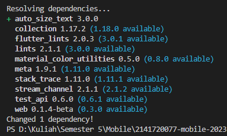
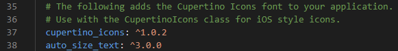
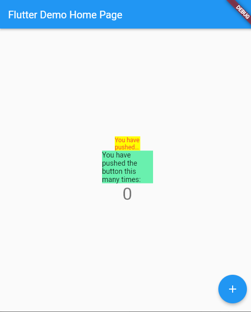
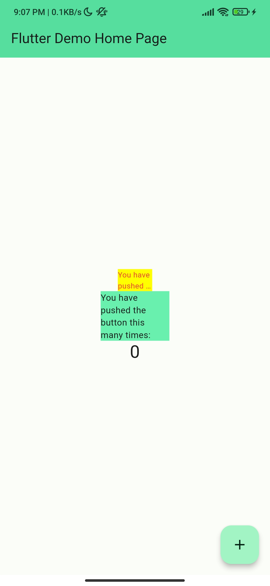

### Week 10

### Manajemen Plugin

Ahmad Bima Tristan Ibrahim

2141720077

### Praktikum Menerapkan Plugin di Project Flutter

Selesaikan langkah-langkah praktikum berikut ini menggunakan editor Visual Studio Code (VS Code) atau Android Studio atau code editor lain kesukaan Anda.

**Langkah 1: Buat Project Baru**

Buatlah sebuah project flutter baru dengan nama **flutter_plugin_pubdev**. Lalu jadikan repository di GitHub Anda dengan nama **flutter_plugin_pubdev**.

Langkah 2: Menambahkan Plugin
Tambahkan plugin auto_size_text menggunakan perintah berikut di terminal

```dart
flutter pub add auto_size_text
```



Jika berhasil, maka akan tampil nama plugin beserta versinya di file pubspec.yaml pada bagian dependencies.

**Succes Added**



**Langkah 3: Buat file red_text_widget.dart**

Buat file baru bernama `red_text_widget.dart` di dalam folder lib lalu isi kode seperti berikut.

```dart
import 'package:flutter/material.dart';

class RedTextWidget extends StatelessWidget {
  const RedTextWidget({Key? key}) : super(key: key);

  @override
  Widget build(BuildContext context) {
    return Container();
  }
}
```

**Langkah 4: Tambah Widget AutoSizeText**

Masih di file `red_text_widget.dart`, untuk menggunakan plugin `auto_size_text`, ubahlah kode `return Container()` menjadi seperti berikut.

```dart
return AutoSizeText(
      text,
      style: const TextStyle(color: Colors.red, fontSize: 14),
      maxLines: 2,
      overflow: TextOverflow.ellipsis,
);
```

Setelah Anda menambahkan kode di atas, Anda akan mendapatkan info error. Mengapa demikian? Jelaskan dalam laporan praktikum Anda!

**Answer**

The method 'AutoSizeText' isn't defined for the type 'RedTextWidget'.
Try correcting the name to the name of an existing method, or defining a method named 'AutoSizeText'.dartundefined_method

**Description**

Pesan error tersebut muncul karena mencoba memanggil metode AutoSizeText pada tipe RedTextWidget, tetapi metode tersebut tidak didefinisikan untuk tipe tersebut.

**Description**

Pesan error tersebut muncul ketika Anda mencoba menggunakan variabel atau fungsi bernama text yang belum didefinisikan.

**Langkah 5: Buat Variabel text dan parameter di constructor**

Tambahkan variabel `text` dan parameter di constructor seperti berikut.

```dart
class RedTextWidget extends StatelessWidget {
  final String text;

  const RedTextWidget({Key? key, required this.text}) : super(key: key);
```

**Langkah 6: Tambahkan widget di main.dart**

Buka file `main.dart` lalu tambahkan di dalam `children:` pada `class _MyHomePageState`

```dart
Container(
   color: Colors.yellowAccent,
   width: 50,
   child: const RedTextWidget(
             text: 'You have pushed the button this many times:',
          ),
),
Container(
    color: Colors.greenAccent,
    width: 100,
    child: const Text(
           'You have pushed the button this many times:',
          ),
),
```

**Run** aplikasi tersebut dengan tekan **F5**, maka hasilnya akan seperti berikut.

**Example**



**Output Praktikum**



**Tugas Praktikum**

1. Jelaskan maksud dari langkah 2 pada praktikum tersebut!

**Answer**

Langkah 2 pada praktikum tersebut menambahkan plugin `auto_size_text` pada `pubspec.yaml`

Plugin ini digunakan untuk mengatur ukuran teks secara otomatis sesuai dengan ukuran `widget` yang digunakan.

2. Jelaskan maksud dari langkah 5 pada praktikum tersebut!

**Answer**

Langkah 5 pada praktikum tersebut menambahkan variable text pada class `RedTextWidget`

Variable text ini digunakan untuk menampung teks yang akan ditampilkan pada `widget`

3. Pada langkah 6 terdapat dua widget yang ditambahkan, jelaskan fungsi dan perbedaannya!

**Answer**

Pada langkah 6 terdapat dua widget yang ditambahkan yaitu `AutoSizeText` dan `Text`

Kedua `widget` ini digunakan untuk menampilkan teks pada widget

Perbedaannya adalah `AutoSizeText` digunakan untuk mengatur ukuran teks secara otomatis sesuai dengan ukuran widget yang digunakan, sedangkan `Text` tidak mengatur ukuran teks secara otomatis

4. Jelaskan maksud dari tiap parameter yang ada di dalam plugin auto_size_text berdasarkan tautan pada dokumentasi!

**Answer**

- text: `Teks yang akan ditampilkan pada widget.`
- style: `Style teks yang akan ditampilkan pada widget.`
- maxLines: `Jumlah maksimal baris yang akan ditampilkan pada widget.`
- overflow: `Teks yang akan ditampilkan jika melebihi jumlah maksimal baris yang ditampilkan pada widget.`
- minFontSize: `Ukuran minimal teks yang akan ditampilkan pada widget.`
- maxFontSize: `Ukuran maksimal teks yang akan ditampilkan pada widget.`
- stepGranularity: `Ukuran langkah yang digunakan untuk mengatur ukuran teks pada widget.`
- presetFontSizes: `Ukuran teks yang akan ditampilkan pada widget.`
- group: `Group yang digunakan untuk mengatur ukuran teks pada widget.`
- textAlign: `Penataan teks yang akan ditampilkan pada widget.`
- textDirection: `Arah teks yang akan ditampilkan pada widget.`
- textScaleFactor: `Faktor skala teks yang akan ditampilkan pada widget.`
- semanticsLabel: `Label semantik yang digunakan untuk mengatur ukuran teks pada widget.`
- wrapWords: `Mengatur apakah teks yang akan ditampilkan pada widget akan dibungkus atau tidak.`
- locale: `Digunakan untuk memilih font ketika karakter Unicode yang sama dapat dirender secara berbeda, bergantung pada lokalnya.`