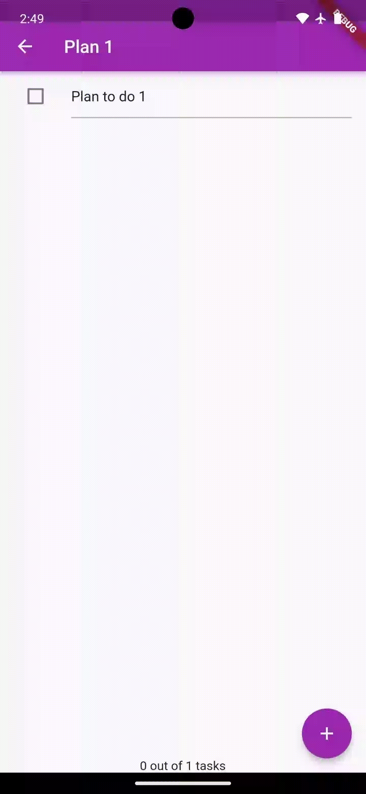
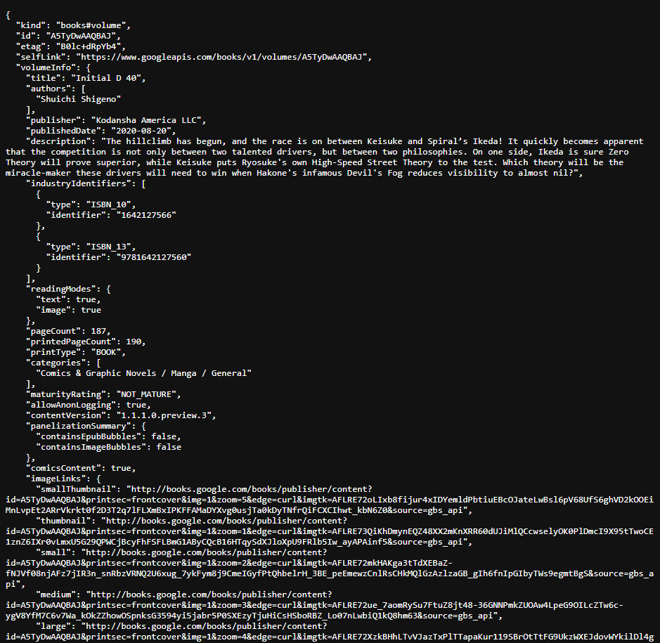
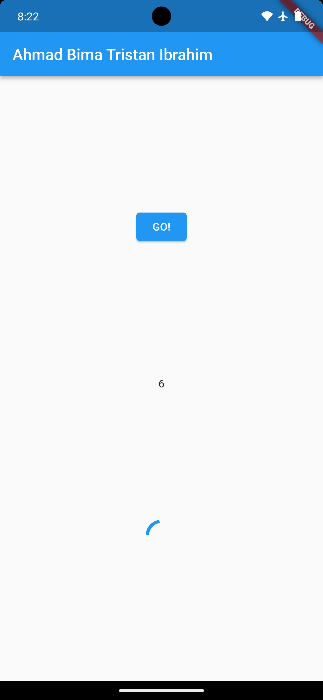
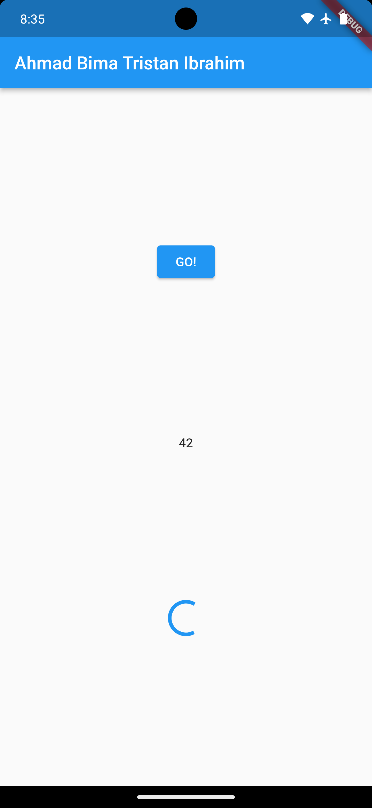
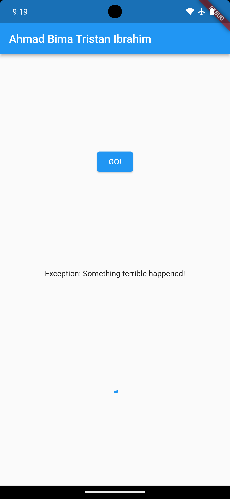
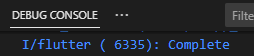
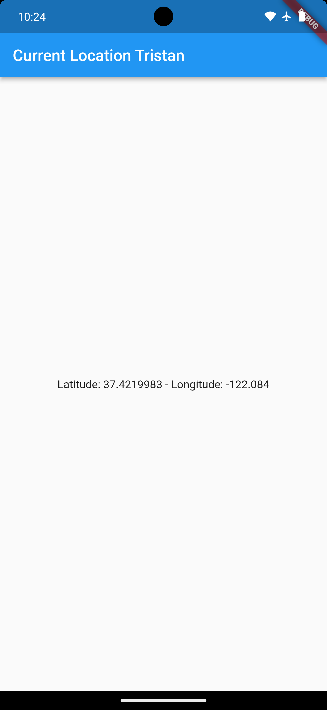

### Week 12

### Pemrograman Asynchronous

Ahmad Bima Tristan Ibrahim

2141720077

### **Praktikum 1: Mengunduh Data dari Web Service (API)**

Selesaikan langkah-langkah praktikum berikut ini menggunakan editor Visual Studio Code (VS Code) atau Android Studio atau code editor lain kesukaan Anda. Jawablah di laporan praktikum Anda pada setiap soal yang ada di beberapa langkah praktikum ini.

<p>

**Langkah 1: Buat Project Baru**

Buatlah sebuah project flutter baru dengan nama **books** di folder **src week-12** repository GitHub Anda.

Kemudian Tambahkan dependensi ``http`` dengan mengetik perintah berikut di terminal.

```dart
flutter pub add http
```

**Langkah 2: Cek file pubspec.yaml**

Jika berhasil install plugin, pastikan plugin ``http`` telah ada di file ``pubspec`` ini seperti berikut.

```dart
dependencies:
  flutter:
    sdk: flutter
  http: ^1.1.0
```

**Langkah 3: Buka file main.dart**

Ketiklah kode seperti berikut ini

>**Soal 1**
>
>Tambahkan **nama panggilan Anda** pada ``title`` app sebagai identitas hasil pekerjaan Anda.

```dart
import 'dart:async';
import 'package:flutter/material.dart';
import 'package:http/http.dart';
import 'package:http/http.dart' as http;

void main() {
  runApp(const MyApp());
}

class MyApp extends StatelessWidget {
  const MyApp({super.key});

  @override
  Widget build(BuildContext context) {
    return MaterialApp(
      title: 'Flutter Demo',
      theme: ThemeData(
        primarySwatch: Colors.blue,
        visualDensity: VisualDensity.adaptivePlatformDensity,
      ),
      home: const FuturePage(),
    );
  }
}

class FuturePage extends StatefulWidget {
  const FuturePage({super.key});

  @override
  State<FuturePage> createState() => _FuturePageState();
}

class _FuturePageState extends State<FuturePage> {
  String result = '';
  @override
  Widget build(BuildContext context) {
    return Scaffold(
      appBar: AppBar(
        title: const Text('Bima Tristan'),
      ),
      body: Center(
        child: Column(children: [
          const Spacer(),
          ElevatedButton(
            child: const Text('GO!'),
            onPressed: () {},
          ),
          const Spacer(),
          Text(result),
          const Spacer(),
          const CircularProgressIndicator(),
          const Spacer(),
        ]),
      ),
    );
  }
}
```
Hasil Output Soal 1


Catatan:<p>
Tidak ada yang spesial dengan kode di ``main.dart`` tersebut. Perlu diperhatikan di kode tersebut terdapat widget ``CircularProgressIndicator`` yang akan menampilkan animasi berputar secara terus-menerus, itu pertanda bagus bahwa aplikasi Anda responsif (tidak freeze/lag). Ketika animasi terlihat berhenti, itu berarti UI menunggu proses lain sampai selesai.

**Langkah 4: Tambah method getData()**

Tambahkan method ini ke dalam ``class _FuturePageState`` yang berguna untuk mengambil data dari API Google Books.

```dart
Future<Response> getData() async {
    const authority = 'www.googleapis.com';
    const path = '/books/v1/volumes/junbDwAAQBAJ';
    Uri url = Uri.https(authority, path);
    return http.get(url);
  }
```

>**Soal 2**
>
>- Carilah judul buku favorit Anda di Google Books, lalu ganti ID buku pada variabel path di kode tersebut. Caranya ambil di URL browser Anda seperti gambar berikut ini.

>- Kemudian cobalah akses di browser URI tersebut dengan lengkap seperti ini. Jika menampilkan data JSON, maka Anda telah berhasil. Lakukan capture milik Anda dan tulis di ``README`` pada laporan praktikum. Lalu lakukan commit dengan pesan **"W12: Soal 2"**.


Jawab: 
- 
- 

**Langkah 5: Tambah kode di ElevatedButton**

Tambahkan kode pada ``onPressed`` di ``ElevatedButton`` seperti berikut.

```dart
ElevatedButton(
            child: Text('GO!'),
            onPressed: () {
              setState(() {});
              getData()
              .then((value) {
                result = value.body.toString().substring(0, 450);
                setState(() {});
              }).catchError((_){
                result = 'An error occurred';
                setState(() {});
              });
            },
          ),
```
Lakukan run aplikasi Flutter Anda. Anda akan melihat tampilan akhir seperti gambar berikut. Jika masih terdapat error, silakan diperbaiki hingga bisa running.

>**Soal 3**
>- Jelaskan maksud kode langkah 5 tersebut terkait ``substring`` dan ``catchError``!
>- Capture hasil praktikum Anda berupa GIF dan lampirkan di README. Lalu lakukan commit dengan pesan **"W12: Soal 3"**.

Jawab: 
- substring() adalah metode untuk mengambil substring dari string. Substring merupakan bagian dari string yang dimulai dari indeks tertentu dan berakhir pada indeks tertentu. Metode substring() menerima dua parameter, yaitu indeks awal dan indeks akhir. Indeks awal adalah indeks karakter pertama yang ingin diambil, dan indeks akhir adalah indeks karakter terakhir yang ingin diambil. 
- catchError() adalah metode untuk menangani kesalahan. Metode catchError() menerima satu parameter, yaitu fungsi yang akan dijalankan jika terjadi kesalahan. Fungsi tersebut akan menerima objek kesalahan sebagai parameter. Kode di atas menggunakan substring() untuk mengambil 450 karakter pertama dari respons API. Jika terjadi kesalahan saat mengambil respons API, maka kode tersebut akan menggunakan catchError() untuk menampilkan pesan kesalahan "An error occurred".
- 

### **Praktikum 2: Menggunakan await/async untuk menghindari callbacks**

<p>

Ada alternatif penggunaan Future yang lebih clean, mudah dibaca dan dirawat, yaitu pola async/await. Intinya pada dua kata kunci ini:
- ``async`` digunakan untuk menandai suatu method sebagai asynchronous dan itu harus ditambahkan di depan kode function.
- ``await`` digunakan untuk memerintahkan menunggu sampai eksekusi suatu function itu selesai dan mengembalikan sebuah ``value``. Untuk ``then`` bisa digunakan pada jenis method apapun, sedangkan ``await`` hanya bekerja di dalam method ``async``.

<p>

**Langkah 1: Buka file main.dart**

Tambahkan tiga method berisi kode seperti berikut di dalam ``class _FuturePageState``.

```dart
Future<int> returnOneAsync() async {
  await Future.delayed(const Duration(seconds: 3));
  return 1;
}

Future<int> returnTwoAsync() async {
  await Future.delayed(const Duration(seconds: 3));
  return 2;
}

Future<int> returnThreeAsync() async {
  await Future.delayed(const Duration(seconds: 3));
  return 3;
}
```

**Langkah 2: Tambah method count()**

Lalu tambahkan lagi method ini di bawah ketiga method sebelumnya.

```dart
Future count() async {
    int total = 0;
    total = await returnOneAsync();
    total += await returnTwoAsync();
    total += await returnThreeAsync();
    setState(() {
      result = total.toString();
    });
  }
```

**Langkah 3: Panggil count()**

Lakukan comment kode sebelumnya, ubah isi kode ``onPressed()`` menjadi seperti berikut.

```dart
ElevatedButton(
            child: const Text('GO!'),
            onPressed: () {
              count();
            },
          ),
```

**Langkah 4: Run**

Akhirnya, **run** atau tekan **F5** jika aplikasi belum running. Maka Anda akan melihat seperti gambar berikut, hasil angka 6 akan tampil setelah delay 9 detik.



>**Soal 4**
>- Jelaskan maksud kode langkah 1 dan 2 tersebut!
>- Capture hasil praktikum Anda berupa GIF dan lampirkan di README. Lalu lakukan commit dengan pesan "**W12: Soal 4**".

Jawab: Langkah 1 kode di atas adalah kode dart yang terdiri dari tiga fungsi asynchronous, yaitu ``returnOneAsync()``, ``returnTwoAsync()``, dan ``returnThreeAsync()``. Ketiga fungsi ini mengembalikan nilai int dan menggunakan ``Future.delayed()`` untuk menunda eksekusi selama 3 detik. Berikut adalah penjelasan masing-masing fungsi:

- returnOneAsync() Fungsi ini mengembalikan nilai 1 setelah 3 detik.
- returnTwoAsync() Fungsi ini mengembalikan nilai 2 setelah 3 detik.
- returnThreeAsync() Fungsi ini mengembalikan nilai 3 setelah 3 detik. Langkah 2 Kode di atas adalah sebuah fungsi asynchronous bernama ``count()`` yang digunakan untuk menghitung jumlah dari tiga fungsi asynchronous lainnya, yaitu ``returnOneAsync()``, ``returnTwoAsync()``, dan ``returnThreeAsync()``. Fungsi count() ini mengembalikan Future, yang berarti bahwa eksekusinya tidak akan memblokir kode lainnya.


### **Praktikum 3: Menggunakan Completer di Future**

Menggunakan Future dengan ``then``, ``catchError``, ``async``, dan ``await`` mungkin sudah cukup untuk banyak kasus, tetapi ada alternatif melakukan operasi async di Dart dan Flutter yaitu dengan ``class Completer``.

**Completer** membuat object Future yang mana Anda dapat menyelesaikannya nanti (late) dengan return sebuah value atau error.

Setelah Anda menyelesaikan praktikum 2, Anda dapat melanjutkan praktikum 3 ini. Selesaikan langkah-langkah praktikum berikut ini menggunakan editor Visual Studio Code (VS Code) atau Android Studio atau code editor lain kesukaan Anda. Jawablah di laporan praktikum Anda pada setiap soal yang ada di beberapa langkah praktikum ini.

<p>

**Langkah 1: Buka main.dart**

Pastikan telah impor package async berikut.

```dart
import 'package:async/async.dart';
```

**Langkah 2: Tambahkan variabel dan method**

Tambahkan variabel late dan method di ``class _FuturePageState`` seperti ini.

```dart
late Completer completer;

Future getNumber() {
  completer = Completer<int>();
  calculate();
  return completer.future;
}

Future calculate() async {
  await Future.delayed(const Duration(seconds : 5));
  completer.complete(42);
}
```

**Langkah 3: Ganti isi kode onPressed()**

Tambahkan kode berikut pada fungsi ``onPressed()``. Kode sebelumnya bisa Anda *comment*.

```dart
getNumber().then((value) {
                setState(() {
                  result = value.toString();
                });
              });
```

**Langkah 4:**

Terakhir, **run** atau tekan **F5** untuk melihat hasilnya jika memang belum running. Bisa juga lakukan **hot restart** jika aplikasi sudah running. Maka hasilnya akan seperti gambar berikut ini. Setelah 5 detik, maka angka 42 akan tampil.



>**Soal 5**
>- Jelaskan maksud kode langkah 2 tersebut!
>- Capture hasil praktikum Anda berupa GIF dan lampirkan di README. Lalu lakukan commit dengan pesan "**W12: Soal 5**".

Jawab: kode pada langkah 2, kita menambahkan ``variabel completer`` dan method ``getNumber()`` dan ``calculate()`` di class _FuturePageState.

- ``Variabel completer`` adalah variabel late dari tipe Completer. Variabel ini digunakan untuk menyimpan hasil dari perhitungan angka 42.
- ``Method getNumber()`` mengembalikan nilai dari variabel completer. Method ini memiliki dua langkah:<p> 
 a. Inisialisasi variabel completer dengan nilai baru.<p> b. Memanggil method ``calculate()`` untuk menghitung angka 42.
- ``Method calculate()`` menggunakan ``Future.delayed()`` untuk menunggu 5 detik sebelum menyelesaikan perhitungan angka 42. Setelah 5 detik, method ini akan memanggil method ``completer.complete()`` untuk menyelesaikan perhitungan dan mengembalikan nilai 42 ke variabel completer

**Langkah 5: Ganti method calculate()**

Gantilah isi code method ``calculate()`` seperti kode berikut, atau Anda dapat membuat ``calculate2()``

```dart
calculate() async {
    try {
      await new Future.delayed(const Duration(seconds: 5));
      completer.complete(42);
    } catch (_) {
      completer.completeError({});
    }
  }
```

**Langkah 6: Pindah ke onPressed()**

Ganti menjadi kode seperti berikut.

```dart
getNumber().then((value) {
  setState(() {
    result = value.toString();
  });
}).catchError((e) {
  result = 'An error occurred';
});
```

>**Soal 6**
>- Jelaskan maksud perbedaan kode langkah 2 dengan langkah 5-6 tersebut!
>- Capture hasil praktikum Anda berupa GIF dan lampirkan di README. Lalu lakukan commit dengan pesan "**W12: Soal 6**".

Jawab: 
- Pada langkah 5, kita mengganti isi dari method ``calculate()``. Method ``calculate()`` sebelumnya menggunakan ``await Future.delayed(const Duration(seconds: 5));`` untuk menunggu 5 detik sebelum menyelesaikan perhitungan angka 42. Namun, method ini tidak menangani kesalahan yang mungkin terjadi saat menunggu 5 detik. Kode ini menggunakan try/catch untuk menangani kesalahan yang mungkin terjadi saat menunggu 5 detik. Jika tidak terjadi kesalahan, maka method ini akan memanggil method ``completer.complete()`` untuk menyelesaikan perhitungan dan mengembalikan nilai 42 ke variabel completer. Jika terjadi kesalahan, maka method ini akan memanggil method ``completer.completeError()`` untuk menyelesaikan perhitungan dan mengembalikan nilai {} ke variabel ``completer``.
- Pada langkah 6, kita mengganti kode di method ``onPressed()``. Method ``onPressed()`` sebelumnya menggunakan ``then()`` untuk menangani hasil dari method ``getNumber()``. Namun, method ini tidak menangani kesalahan yang mungkin terjadi saat memanggil method ``getNumber()``. Kode ini menggunakan ``then()`` dan ``catchError()`` untuk menangani hasil dari method ``getNumber()``. Jika tidak terjadi kesalahan, maka method ini akan memanggil method ``setState()`` untuk memperbarui state dari widget. Jika terjadi kesalahan, maka method ini akan memanggil method ``setState()`` untuk memperbarui state dari widget dan menampilkan pesan kesalahan.


### **Praktikum 4: Memanggil Future secara paralel**

Ketika Anda membutuhkan untuk menjalankan banyak Future secara bersamaan, ada sebuah class yang dapat Anda gunakan yaitu: ``FutureGroup``.

``FutureGroup`` tersedia di package ``async``, yang mana itu harus diimpor ke file dart Anda, seperti berikut.

```dart
import 'package:async/async.dart';
```

>Catatan: Package ``dart:async`` dan ``async/async.dart`` merupakan library yang berbeda. Pada beberapa kasus, Anda membutuhkan kedua lib tersebut untuk me-*run* *code async*.

**FutureGroup** adalah sekumpulan dari Future yang dapat run secara paralel. Ketika run secara paralel, maka konsumsi waktu menjadi lebih hemat (cepat) dibanding run method async secara single setelah itu method async lainnya.

Ketika semua code async paralel selesai dieksekusi, maka FutureGroup akan return value sebagai sebuah ``List``, sama juga ketika ingin menambahkan operasi paralel dalam bentuk ``List``.

Setelah Anda menyelesaikan praktikum 3, Anda dapat melanjutkan praktikum 4 ini. Selesaikan langkah-langkah praktikum berikut ini menggunakan editor Visual Studio Code (VS Code) atau Android Studio atau code editor lain kesukaan Anda. Jawablah di laporan praktikum Anda pada setiap soal yang ada di beberapa langkah praktikum ini.

**Langkah 1: Buka file main.dart**

Tambahkan method ini ke dalam ``class _FuturePageState``

```dart
void returnFG() {
    FutureGroup<int> futureGroup = FutureGroup<int>();
    futureGroup.add(returnOneAsync());
    futureGroup.add(returnTwoAsync());
    futureGroup.add(returnThreeAsync());
    futureGroup.close();
    futureGroup.future.then((List<int> value) {
      int total = 0;
      for (var element in value) {
        total += element;
      }
      setState(() {
        result = total.toString();
      });
    });
  }
```

**Langkah 2: Edit onPressed()**

Anda bisa hapus atau comment kode sebelumnya, kemudian panggil method dari langkah 1 tersebut.

```dart
onPressed: () {
  returnFG();
}
```

**Langkah 3: Run**

Anda akan melihat hasilnya dalam 3 detik berupa angka 6 lebih cepat dibandingkan praktikum sebelumnya menunggu sampai 9 detik.

>**Soal 7**
>- Capture hasil praktikum Anda berupa GIF dan lampirkan di README. Lalu lakukan commit dengan pesan "**W12: Soal 7**".

Jawab:
<p>


<p>

**Langkah 4: Ganti variabel futureGroup**

Anda dapat menggunakan FutureGroup dengan ``Future.wait`` seperti kode berikut.

```dart
final futures = Future.wait<int>([
  returnOneAsync(),
  returnTwoAsync(),
  returnThreeAsync(),
]);
```

>**Soal 8**
>- Jelaskan maksud perbedaan kode langkah 1 dan 4!

Jawab: Perbedaan kode pada langkah 1 dan kode langkah 4 adalah pada penggunaan variabel ``futureGroup``. Pada langkah 1, variabel ``futureGroup`` digunakan untuk menampung ``FutureGroup``. ``FutureGroup`` adalah sebuah objek yang dapat digunakan untuk mengelompokkan beberapa Future bersama-sama. Sedangkan pada langkah 4, variabel ``futureGroup`` diganti dengan ``Future.wait()``. ``Future.wait()`` adalah sebuah fungsi yang dapat digunakan untuk menunggu beberapa Future selesai dijalankan.


### **Praktikum 5: Menangani Respon Error pada Async Code**

Ada beberapa teknik untuk melakukan *handle error* pada code async. Pada praktikum ini Anda akan menggunakan 2 cara, yaitu ``then()`` callback dan pola ``async/await``.

Setelah Anda menyelesaikan praktikum 4, Anda dapat melanjutkan praktikum 5 ini. Selesaikan langkah-langkah praktikum berikut ini menggunakan editor Visual Studio Code (VS Code) atau Android Studio atau code editor lain kesukaan Anda. Jawablah di laporan praktikum Anda pada setiap soal yang ada di beberapa langkah praktikum ini.

<p>

**Langkah 1: Buka file main.dart**

Tambahkan method ini ke dalam ``class _FuturePageState``

```dart
Future returnError() async {
    await Future.delayed(const Duration(seconds: 2));
    throw Exception('Something terrible happened!');
  }
```

**Langkah 2: ElevatedButton**

Ganti dengan kode berikut

```dart
returnError().then((value) {
                setState(() {
                  result = 'Success';
                });
              }).catchError((onError) {
                setState(() {
                  result = onError.toString();
                });
              }).whenComplete(() => print('Complete'));
```

**Langkah 3: Run**

Lakukan run dan klik tombol **GO!** maka akan menghasilkan seperti gambar berikut.



Pada bagian debug console akan melihat teks ``Complete`` seperti berikut.



>**Soal 9**
>- Capture hasil praktikum Anda berupa GIF dan lampirkan di README. Lalu lakukan commit dengan pesan "**W12: Soal 9**".


<p>

**Langkah 4: Tambah method handleError()**

Tambahkan kode ini di dalam ``class _FutureStatePage``

```dart
Future handleError() async {
    try {
      await returnError();
    } catch (error) {
      setState(() {
        result = error.toString();
      });
    } finally {
      print('Complete');
    }
  }
```

>**Soal 10**
>- Panggil method ``handleError()`` tersebut di ``ElevatedButton``, lalu run. Apa hasilnya? Jelaskan perbedaan kode langkah 1 dan 4!

Jawab: <p>
Perbedaan kode pada langkah 1 dan kode langkah 4 adalah pada penanganan error.
- Pada langkah 1, method ``returnError()`` tidak menangani error yang terjadi. Jika error terjadi, maka method tersebut akan berhenti dan tidak mengembalikan nilai apa pun.
- Sedangkan pada langkah 4, method ``handleError()`` menangani error yang terjadi dengan menggunakan ``try-catch-finally``. Pada try block, method ``handleError()`` mencoba untuk menjalankan method ``returnError()``. Jika error terjadi, maka ``try block`` akan berhenti dan error akan ditangkap oleh ``catch block``. Pada ``catch block``, method ``handleError()`` akan menampilkan error ke layar menggunakan ``print()``. ``Finally block`` akan selalu dijalankan, terlepas dari apakah ada error yang terjadi atau tidak.


### **Praktikum 6: Menggunakan Future dengan StatefulWidget**

Seperti yang Anda telah pelajari, ``Stateless`` widget tidak dapat menyimpan informasi (state), ``StatefulWidget`` dapat mengelola variabel dan properti dengan method ``setState()``, yang kemudian dapat ditampilkan pada UI. State adalah informasi yang dapat berubah selama life cycle widget itu berlangsung.

Ada **4 method utama** dalam life cycle ``StatefullWidget``:
- ``initState()``: dipanggil sekali ketika state dibangun. Bisa dikatakan ini juga sebagai konstruktor class.
- ``build()``: dipanggil setiap kali ada perubahan state atau UI. Method ini melakukan destroy UI dan membangun ulang dari nol.
- ``deactive()`` dan ``dispose()``: digunakan untuk menghapus widget dari tree, pada beberapa kasus dimanfaatkan untuk menutup koneksi ke database atau menyimpan data sebelum berpindah screen.

Setelah Anda menyelesaikan praktikum 5, Anda dapat melanjutkan praktikum 6 ini. Selesaikan langkah-langkah praktikum berikut ini menggunakan editor Visual Studio Code (VS Code) atau Android Studio atau code editor lain kesukaan Anda. Jawablah di laporan praktikum Anda pada setiap soal yang ada di beberapa langkah praktikum ini.

**Langkah 1: install plugin geolocator**

Tambahkan plugin geolocator dengan mengetik perintah berikut di terminal.

```
flutter pub add geolocator
```

**Langkah 2: Tambah permission GPS**

Jika Anda menargetkan untuk platform **Android**, maka tambahkan baris kode berikut di file ``android/app/src/main/androidmanifest.xml``

**Langkah 3: Buat file geolocation.dart**

Tambahkan file baru ini di folder lib project Anda.

**Langkah 4: Buat StatefulWidget**

Buat ``class LocationScreen`` di dalam file ``geolocation.dart``

**Langkah 5: Isi kode geolocation.dart**

```dart
import 'package:flutter/material.dart';
import 'package:geolocator/geolocator.dart';

class LocationScreen extends StatefulWidget {
  const LocationScreen({super.key});

  @override
  State<LocationScreen> createState() => _LocationScreenState();
}

class _LocationScreenState extends State<LocationScreen> {
  String myPosition = '';
  @override
  void initState() {
    super.initState();
    getPosition().then((Position myPos)) {
      myPosition = 
          'Latitude: ${myPos.latitude.toString()} - Longitude:
{myPos.longitude.toString()}';
      setState(() {
        myPosition = myPosition;
      });
    });
  }

  @override
  Widget build(BuildContext context) {
    return Scaffold(
      appBar: AppBar(title: const Text('Current Location')),
      body: Center(child: Text(myPosition)),
    );
  }

  Future<Position> getPosition() async {
    await Geolocator.requestPermission();
    await Geolocator.isLocationServiceEnabled();
    Position? position = 
      await Geolocator.getCurrentPosition();
    return position;
  }
}
```

>**Soal 11**
>- Tambahkan **nama panggilan Anda** pada tiap properti ``title`` sebagai identitas pekerjaan Anda.

Jawab:
```dart
appBar: AppBar(title: const Text('Current Location Tristan')),
```

**Langkah 6: Edit main.dart**

Panggil screen baru tersebut di file main Anda seperti berikut.

```dart
home: LocationScreen(),
```

**Langkah 7: Run**

Run project Anda di **device** atau **emulator** (**bukan browser**), maka akan tampil seperti berikut ini.


<p>

**Langkah 8: Tambahkan animasi loading**
Tambahkan widget loading seperti kode berikut. Lalu hot restart, perhatikan perubahannya.

```dart
@override
  Widget build(BuildContext context) {
    final myWidget =
    myPosition == '' ? const CircularProgressIndicator() : Text(myPosition);
    ;
    return Scaffold(
      appBar: AppBar(title: const Text('Current Location Tristan')),
      body: Center(child:myWidget),
      );
  }
```

>**Soal 12**
>- Jika Anda tidak melihat animasi loading tampil, kemungkinan itu berjalan sangat cepat. Tambahkan delay pada method ``getPosition()`` dengan kode ``await Future.delayed(const Duration(seconds: 3));``
>- Apakah Anda mendapatkan koordinat GPS ketika run di browser? Mengapa demikian?
>- Capture hasil praktikum Anda berupa GIF dan lampirkan di README. Lalu lakukan commit dengan pesan "**W12: Soal 12**".

Jawab: Karena package geolocator juga support di browser, sehingga koordinat GPS juga bisa didapatkan pada browser, beserta izinnya.

