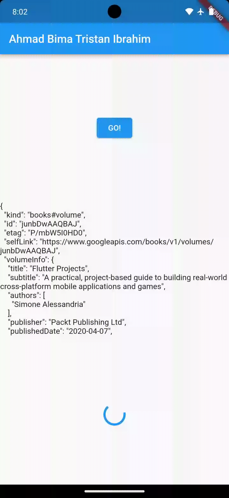

### Week 12

### Pemrograman Asynchronous

Ahmad Bima Tristan Ibrahim

2141720077

### **Praktikum 1: Mengunduh Data dari Web Service (API)**

Selesaikan langkah-langkah praktikum berikut ini menggunakan editor Visual Studio Code (VS Code) atau Android Studio atau code editor lain kesukaan Anda. Jawablah di laporan praktikum Anda pada setiap soal yang ada di beberapa langkah praktikum ini.

<p>

**Langkah 1: Buat Project Baru**

Buatlah sebuah project flutter baru dengan nama **books** di folder **src week-12** repository GitHub Anda.

Kemudian Tambahkan dependensi ``http`` dengan mengetik perintah berikut di terminal.

```dart
flutter pub add http
```

**Langkah 2: Cek file pubspec.yaml**

Jika berhasil install plugin, pastikan plugin ``http`` telah ada di file ``pubspec`` ini seperti berikut.

```dart
dependencies:
  flutter:
    sdk: flutter
  http: ^1.1.0
```

**Langkah 3: Buka file main.dart**

Ketiklah kode seperti berikut ini

**Soal 1**

Tambahkan **nama panggilan Anda** pada ``title`` app sebagai identitas hasil pekerjaan Anda.

```dart
import 'dart:async';
import 'package:flutter/material.dart';
import 'package:http/http.dart';
import 'package:http/http.dart' as http;

void main() {
  runApp(const MyApp());
}

class MyApp extends StatelessWidget {
  const MyApp({super.key});

  @override
  Widget build(BuildContext context) {
    return MaterialApp(
      title: 'Flutter Demo',
      theme: ThemeData(
        primarySwatch: Colors.blue,
        visualDensity: VisualDensity.adaptivePlatformDensity,
      ),
      home: const FuturePage(),
    );
  }
}

class FuturePage extends StatefulWidget {
  const FuturePage({super.key});

  @override
  State<FuturePage> createState() => _FuturePageState();
}

class _FuturePageState extends State<FuturePage> {
  String result = '';
  @override
  Widget build(BuildContext context) {
    return Scaffold(
      appBar: AppBar(
        title: const Text('Bima Tristan'),
      ),
      body: Center(
        child: Column(children: [
          const Spacer(),
          ElevatedButton(
            child: const Text('GO!'),
            onPressed: () {},
          ),
          const Spacer(),
          Text(result),
          const Spacer(),
          const CircularProgressIndicator(),
          const Spacer(),
        ]),
      ),
    );
  }
}
```
Hasil Output Soal 1


Catatan:<p>
Tidak ada yang spesial dengan kode di ``main.dart`` tersebut. Perlu diperhatikan di kode tersebut terdapat widget ``CircularProgressIndicator`` yang akan menampilkan animasi berputar secara terus-menerus, itu pertanda bagus bahwa aplikasi Anda responsif (tidak freeze/lag). Ketika animasi terlihat berhenti, itu berarti UI menunggu proses lain sampai selesai.

**Langkah 4: Tambah method getData()**

Tambahkan method ini ke dalam ``class _FuturePageState`` yang berguna untuk mengambil data dari API Google Books.

```dart
Future<Response> getData() async {
    const authority = 'www.googleapis.com';
    const path = '/books/v1/volumes/junbDwAAQBAJ';
    Uri url = Uri.https(authority, path);
    return http.get(url);
  }
```

**Soal 2**

- Carilah judul buku favorit Anda di Google Books, lalu ganti ID buku pada variabel path di kode tersebut. Caranya ambil di URL browser Anda seperti gambar berikut ini.


- Kemudian cobalah akses di browser URI tersebut dengan lengkap seperti ini. Jika menampilkan data JSON, maka Anda telah berhasil. Lakukan capture milik Anda dan tulis di ``README`` pada laporan praktikum. Lalu lakukan commit dengan pesan **"W12: Soal 2"**.


Jawab: 
- 
- 

**Langkah 5: Tambah kode di ElevatedButton**

Tambahkan kode pada ``onPressed`` di ``ElevatedButton`` seperti berikut.

```dart
ElevatedButton(
            child: Text('GO!'),
            onPressed: () {
              setState(() {});
              getData()
              .then((value) {
                result = value.body.toString().substring(0, 450);
                setState(() {});
              }).catchError((_){
                result = 'An error occurred';
                setState(() {});
              });
            },
          ),
```
Lakukan run aplikasi Flutter Anda. Anda akan melihat tampilan akhir seperti gambar berikut. Jika masih terdapat error, silakan diperbaiki hingga bisa running.

**Soal 3**
- Jelaskan maksud kode langkah 5 tersebut terkait ``substring`` dan ``catchError``!
- Capture hasil praktikum Anda berupa GIF dan lampirkan di README. Lalu lakukan commit dengan pesan **"W12: Soal 3"**.

Jawab: 
- substring() adalah metode untuk mengambil substring dari string. Substring merupakan bagian dari string yang dimulai dari indeks tertentu dan berakhir pada indeks tertentu. Metode substring() menerima dua parameter, yaitu indeks awal dan indeks akhir. Indeks awal adalah indeks karakter pertama yang ingin diambil, dan indeks akhir adalah indeks karakter terakhir yang ingin diambil. 
- catchError() adalah metode untuk menangani kesalahan. Metode catchError() menerima satu parameter, yaitu fungsi yang akan dijalankan jika terjadi kesalahan. Fungsi tersebut akan menerima objek kesalahan sebagai parameter. Kode di atas menggunakan substring() untuk mengambil 450 karakter pertama dari respons API. Jika terjadi kesalahan saat mengambil respons API, maka kode tersebut akan menggunakan catchError() untuk menampilkan pesan kesalahan "An error occurred".
- 