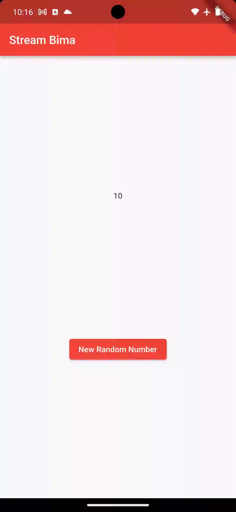
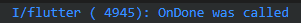
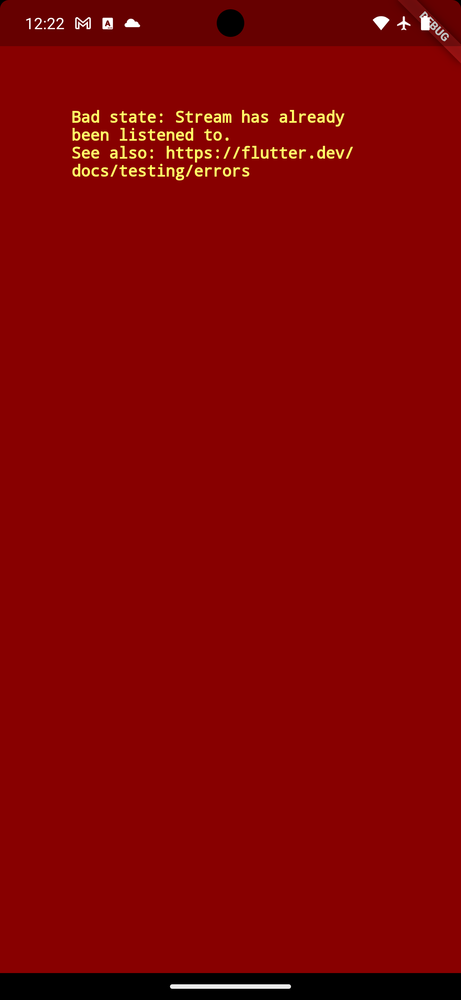

### Week 13

### Lanjutan State Management dengan Streams

Ahmad Bima Tristan Ibrahim

2141720077

### Praktikum 1: Dart Streams


>**Soal 1**
>- Tambahkan nama panggilan Anda pada title app sebagai identitas hasil pekerjaan Anda.
>- Gantilah warna tema aplikasi sesuai kesukaan Anda.
>- Lakukan commit hasil jawaban Soal 1 dengan pesan "W13: Jawaban Soal 1"

Jawab: 
```dart
title: 'Stream Bima',
      theme: ThemeData(
        primarySwatch: Colors.red,
      ),
      home: const StreamHomePage(),
```

>**Soal 2**
>- Tambahkan 5 warna lainnya sesuai keinginan Anda pada variabel colors tersebut.
>- Lakukan commit hasil jawaban Soal 2 dengan pesan "W13: Jawaban Soal 2"

Jawab:
```dart
class ColorStram {
  final List<Color> colors = [
    Colors.blueGrey,
    Colors.amber,
    Colors.deepPurple,
    Colors.lightBlue,
    Colors.teal,
    Colors.blueGrey,
    Colors.lime,
    Colors.deepPurple,
    Colors.red,
    Colors.lightGreen,
  ];
}
```

>**Soal 3**
>- Jelaskan fungsi keyword yield* pada kode tersebut!
>- Apa maksud isi perintah kode tersebut?
>- Lakukan commit hasil jawaban Soal 3 dengan pesan "W13: Jawaban Soal 3"

Jawab:

- Pada Dart, penggunaan yield* digunakan dalam konteks pengembalian nilai dari suatu fungsi yang juga merupakan generator. Generator adalah fungsi yang menghasilkan serangkaian nilai secara berurutan dan dapat dihentikan atau dilanjutkan. <p><p>Secara keseluruhan, kode tersebut membuat sebuah stream yang menghasilkan warna dari sebuah array colors secara berulang setiap detik. Kode tersebut hanya mendefinisikan stream dan tidak mencetak atau menggunakan stream tersebut. Untuk menggunakan stream tersebut, Anda dapat menggabungkannya dengan operator .listen atau menggunakannya dalam blok await for jika berada dalam konteks async.

>**Soal 4**
>- Capture hasil praktikum Anda berupa GIF dan lampirkan di README.
>- Lakukan commit hasil jawaban Soal 4 dengan pesan "W13: Jawaban Soal 4"

Jawab: 


>**Soal 5**
>- Jelaskan perbedaan menggunakan listen dan await for (langkah 9) !
>- Lakukan commit hasil jawaban Soal 5 dengan pesan "W13: Jawaban Soal 5"

Jawab:

Kedua pendekatan tersebut, yakni menggunakan await for dan listen, berfungsi untuk mendengarkan perubahan pada stream, tetapi terdapat perbedaan utama dalam cara mereka berinteraksi dengan stream.

- await for mengharapkan fungsi yang dilabeli async, sementara listen dapat digunakan di dalam atau di luar fungsi yang diberi label async.
- await for digunakan untuk membuat loop yang akan terus menunggu dan mendengarkan stream, sementara listen digunakan untuk menetapkan fungsi callback yang akan dipanggil setiap kali ada perubahan pada stream.

Dalam kedua kasus, tujuannya tetap sama, yaitu merespons perubahan pada stream dan memperbarui UI melalui setState ketika ada perubahan warna. Pilihan antara keduanya tergantung pada kebutuhan dan struktur kode aplikasi

>**Soal 6**
>- Jelaskan maksud kode langkah 8 dan 10 tersebut!
>- Capture hasil praktikum Anda berupa GIF dan lampirkan di README.
>- Lalu lakukan commit dengan pesan "W13: Jawaban Soal 6".

Jawab:

Secara keseluruhan, langkah 8 dan 10 ini menciptakan dan mengelola stream angka dengan menggunakan NumberStream, menginisialisasi stream controller, mendengarkan perubahan pada stream, dan menambahkan angka acak ke dalam stream.


>**Soal 7**
>- Jelaskan maksud kode langkah 13 sampai 15 tersebut!
>- Kembalikan kode seperti semula pada Langkah 15, comment addError() agar Anda dapat melanjutkan ke praktikum 3 berikutnya.
>- Lalu lakukan commit dengan pesan "W13: Jawaban Soal 7".

Jawab:
- Pada langkah 13, kita menambahkan sebuah metode bernama addError() ke dalam objek NumberStream yang mungkin merupakan suatu kelas yang mengelola stream angka. Metode ini bertujuan untuk menambahkan pesan error ke dalam sink (tempat penyimpanan) stream dengan menggunakan controller.sink.addError('error').

- Pada langkah 14, kita menambahkan metode onError ke dalam fungsi listen yang mendengarkan perubahan pada stream dalam fungsi initState(). Ketika terjadi error pada stream, fungsi onError akan dipanggil, dan Anda mengupdate nilai lastNumber menjadi -1. Ini memberikan cara untuk menangani kesalahan yang mungkin terjadi pada stream.

- Pada langkah 15, kita melakukan komentar pada dua baris kode yang awalnya digunakan untuk menambahkan angka acak ke dalam stream. Ini berarti bahwa metode addRandomNumber() sekarang tidak melakukan apa pun, dan angka tidak lagi ditambahkan ke dalam stream.

>**Soal 8**
>- Jelaskan maksud kode langkah 1-3 tersebut!
>- Capture hasil praktikum Anda berupa GIF dan lampirkan di README.
>- Lalu lakukan commit dengan pesan "W13: Jawaban Soal 8".

Jawab: 

- Pada langkah 1, Anda menambahkan variabel transformer ke dalam kelas _StreamHomePageState. Variabel ini memiliki tipe StreamTransformer, yang merupakan objek yang dapat mengubah (transform) nilai di dalam stream.

- Pada langkah 2, Anda membuat objek StreamTransformer dengan menggunakan metode fromHandlers. Objek ini digunakan untuk mengubah nilai di dalam stream. Dalam kasus ini, nilai diubah dengan mengalikan setiap nilai dengan 10. Selain itu, terdapat penanganan error yang menghasilkan nilai -1, dan penanganan ketika stream selesai.

- Pada langkah 3, Anda menggunakan transform pada stream untuk menerapkan transformasi yang telah ditentukan oleh transformer. Setiap nilai yang masuk ke dalam stream akan dikalikan dengan 10 sesuai dengan logika yang didefinisikan dalam transformer. Selanjutnya, Anda mendengarkan perubahan pada stream seperti biasa dan memperbarui UI melalui setState.


>**Soal 9**
>- Jelaskan maksud kode langkah 2, 6 dan 8 tersebut!
>- Capture hasil praktikum Anda berupa GIF dan lampirkan di README.
>- Lalu lakukan commit dengan pesan "W13: Jawaban Soal 9".

Jawab: 

- Langkah 2
Pada langkah ini, Anda sedang mengedit metode initState() dalam framework Flutter. initState() adalah metode yang dipanggil setelah widget telah diinisialisasi, dan ini sering digunakan untuk melakukan konfigurasi awal dan memulai sumber daya yang diperlukan.

- Langkah 6
Langkah ini menunjukkan bagaimana menangani pembuangan (disposing) sumber daya yang digunakan oleh widget. Metode dispose() dipanggil ketika widget dihapus dari pohon widget.

- Langkah 8
Dengan langkah ini, memberikan fungsionalitas untuk menambahkan angka acak ke aliran sesuai dengan kondisi-kondisi tertentu, dan Anda menangani dengan bijak situasi di mana kontroler aliran sudah ditutup.





>**Soal 10**
>- Jelaskan mengapa error itu bisa terjadi ?

Jawab: 

Kesalahan tersebut terjadi ketika mencoba untuk menambahkan atau membuat dua langganan pada stream yang sama, tanpa membatalkan langganan sebelumnya. Hal tersebut terjadi ketika inisialisasi langganan2 pada metode initState() karena sudah ada inisialisasi langganan untuk menangani stream yang sama pada satu waktu.



>**Soal 11**
>- Jelaskan mengapa hal itu bisa terjadi ?
>- Capture hasil praktikum Anda berupa GIF dan lampirkan di README.
>- Lalu lakukan commit dengan pesan "W13: Jawaban Soal 10,11".

Jawab: 

Saat tombol "New Random Number" ditekan, maka akan menghasilkan dua angka random yang sama. Angka-angka tersebut merupakan output dari stream yang dipanggil oleh objek subscription dan subscription2. Stream tersebut akan mengembalikan nilai berupa event (angka random) yang dipisahkan dengan tanda "-". Saat tombol "Stop Stream" ditekan, maka akan menghentikan langganan terhadap stream. Hal ini menyebabkan stream tidak lagi bisa mengeluarkan output, meskipun tombol "New Random Number" ditekan.


